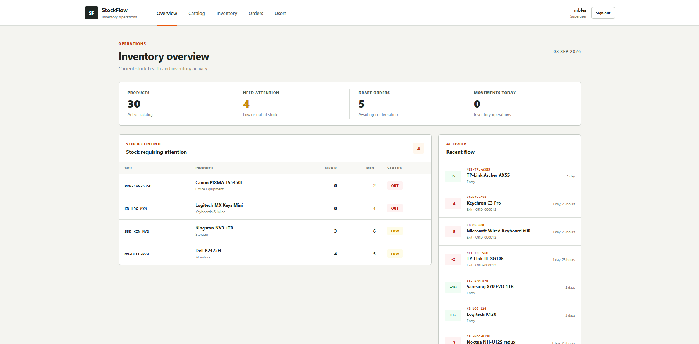
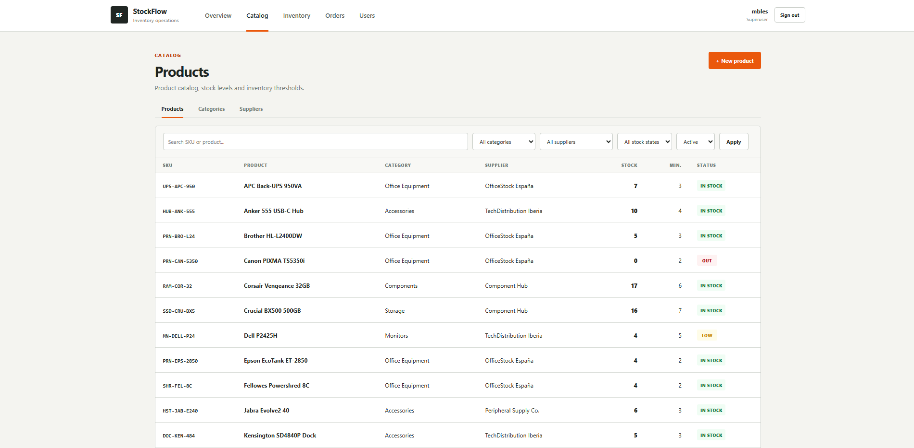
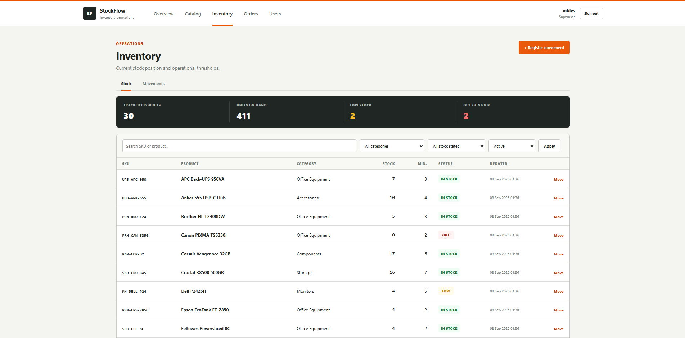
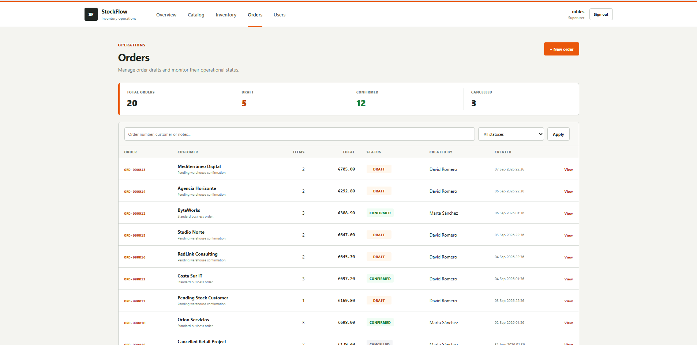
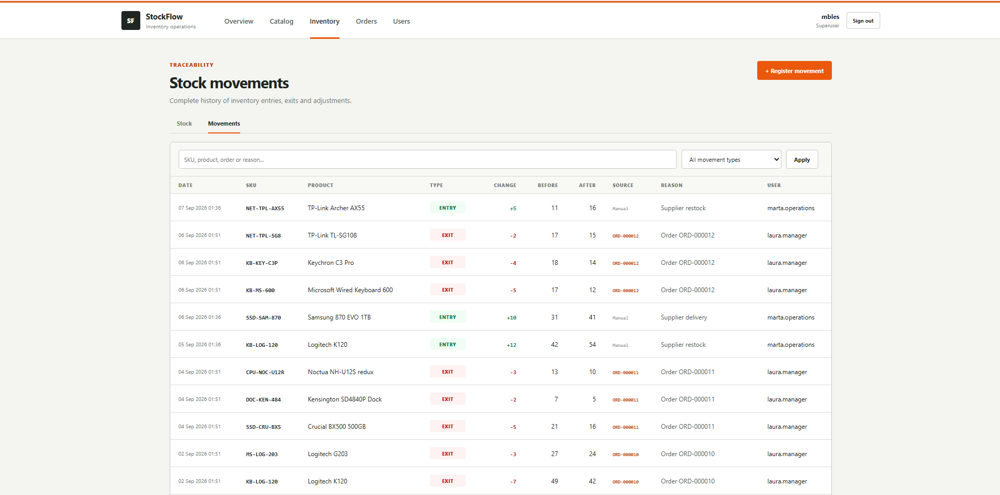
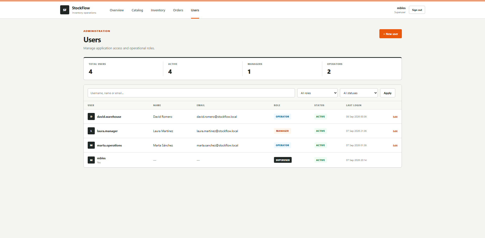
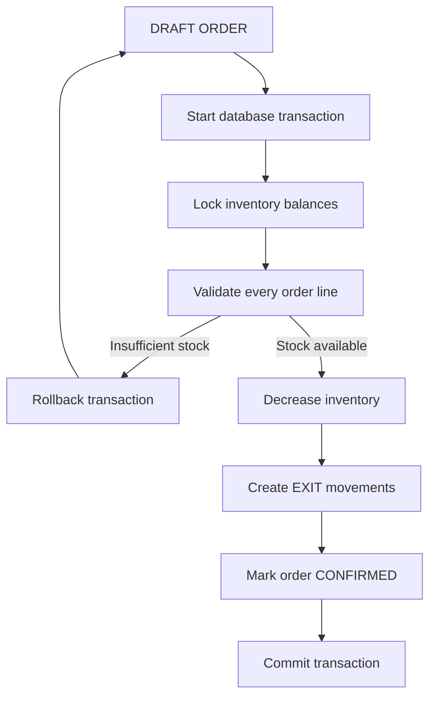

<div align="center">

# StockFlow

### Inventory and order management with transactional consistency

<p>
  A Django application for managing products, suppliers, inventory,
  stock movements, orders and operational users.
</p>

<p>
  
  
  
  
  
</p>

<p>
  
  
  
  
</p>

</div>

<br>

<p align="center">
  
</p>

---

## About StockFlow

**StockFlow** is an inventory and order management application built with Django and PostgreSQL.

The project focuses on more than basic CRUD operations. Its main goal is to explore how business rules, transactional consistency, permissions and multiple interfaces can be structured around the same domain logic.

StockFlow manages:

- products, categories and suppliers;
- current inventory balances;
- traceable stock movements;
- draft, confirmed and cancelled orders;
- transactional order confirmation;
- Manager and Operator roles;
- server-rendered interfaces enhanced with HTMX;
- a REST API powered by Django REST Framework.

The central rule is simple:

> An order must never leave inventory in a partially updated state.

If a single product cannot satisfy a confirmation, **the complete operation is rolled back**.

---

## Screenshots

<table>
  <tr>
    <td width="50%" align="center">
      
    </td>
    <td width="50%" align="center">
      
    </td>
  </tr>
  <tr>
    <td align="center">
      <strong>Product catalog</strong>
    </td>
    <td align="center">
      <strong>Inventory</strong>
    </td>
  </tr>
</table>

<br>

<table>
  <tr>
    <td width="50%" align="center">
      
    </td>
    <td width="50%" align="center">
      
    </td>
  </tr>
  <tr>
    <td align="center">
      <strong>Order workflow</strong>
    </td>
    <td align="center">
      <strong>Stock movement history</strong>
    </td>
  </tr>
</table>

<br>

<p align="center">
  
</p>

<p align="center">
  <strong>User and role management</strong>
</p>

---

## Core features

### Catalog

StockFlow provides management for:

- products;
- categories;
- suppliers;
- SKUs;
- prices;
- minimum stock thresholds;
- active and inactive products.

Products are linked to an inventory balance automatically.

---

### Inventory

Inventory is deliberately separated from the product catalog.

Each product has a current balance represented by an `InventoryBalance`, while meaningful stock changes are recorded as immutable `StockMovement` entries.

Supported operations include:

- stock entries;
- stock exits;
- inventory adjustments;
- minimum-stock monitoring;
- low-stock detection;
- out-of-stock detection;
- movement history;
- order-linked stock movements.

Stock cannot become negative through normal domain operations.

---

### Orders

Orders follow a controlled workflow:

```text
DRAFT
├── CONFIRMED
└── CANCELLED
```

While an order is in `DRAFT`:

- products can be added;
- quantities can be changed;
- lines can be removed;
- current inventory is not modified;
- stock is not reserved.

Once an order is `CONFIRMED` or `CANCELLED`, it becomes locked.

---

## Transactional order confirmation

Order confirmation is the main domain operation in StockFlow.

When a draft is confirmed:

1. A database transaction starts.
2. The order is validated.
3. Relevant inventory balances are locked with `select_for_update()`.
4. Stock availability is checked for **every order line**.
5. If any product has insufficient stock, the entire transaction is rolled back.
6. If every line is valid, stock balances are decremented.
7. An `EXIT` stock movement is created for each order line.
8. Each movement is linked to the confirmed order.
9. The order becomes `CONFIRMED`.



This prevents situations such as:

```text
Product A updated successfully
Product B fails
Product A remains incorrectly deducted
```

Instead:

```text
Product A fails to persist
Product B fails
Order remains DRAFT
No movements are created
Inventory remains unchanged
```

---

## Domain architecture

StockFlow is divided into focused Django applications:

```text
apps/
├── accounts/
├── api/
├── catalog/
├── dashboard/
├── inventory/
└── orders/
```

The application avoids placing business logic directly inside views.

### Models

Models represent persistent domain state and database constraints.

### Services

Services contain state-changing business operations.

Examples:

```text
register_stock_entry()
register_stock_exit()
adjust_stock()

create_order()
add_order_item()
update_order_item_quantity()
remove_order_item()
confirm_order()
cancel_order()
```

### Selectors

Selectors encapsulate read-oriented queries used by views and API endpoints.

### Interfaces

The same domain logic is consumed from:

```text
Django Templates
        │
        ├── regular HTTP forms
        │
        └── HTMX
                │
                ▼
          Service Layer
                ▲
                │
              DRF
                │
              JSON
```

There is no separate implementation of the order confirmation workflow for the REST API.

---

## Historical order pricing

Order lines store their own unit price.

This means changing the current price of a product does not modify historical orders.

Example:

```text
Product price when ordered: €20.00
Quantity: 2
Order line total: €40.00

Product price later changes to €25.00

Historical order total remains: €40.00
```

This preserves the original commercial state of an order.

---

## HTMX and progressive enhancement

The main application uses traditional server-rendered Django templates.

HTMX is applied specifically to the order workspace, where partial updates provide a meaningful UX improvement.

HTMX handles:

- adding products;
- updating quantities;
- removing lines;
- confirming orders;
- cancelling drafts;
- displaying inline errors;
- updating totals and workflow state.

The forms still include regular `method` and `action` attributes.

Therefore, if HTMX or JavaScript is unavailable:

```text
POST
  ↓
Django view
  ↓
Redirect
  ↓
GET
```

The workflow remains functional.

With HTMX:

```text
POST
  ↓
Django view
  ↓
Partial template
  ↓
#order-workspace swap
```

This keeps HTMX as an enhancement rather than a dependency for core functionality.

---

## REST API

StockFlow exposes a focused REST API using Django REST Framework.

The API intentionally does **not** expose every database model as unrestricted CRUD.

### Products

```http
GET /api/products/
```

Read-only product catalog.

---

### Inventory

```http
GET /api/inventory/
GET /api/movements/
```

Inventory is intentionally read-only through the REST API.

A client cannot bypass movement tracking with something such as:

```http
PATCH /api/inventory/1/

{
  "quantity": 999
}
```

Stock changes must go through domain operations.

---

### Orders

```http
GET  /api/orders/
POST /api/orders/

GET  /api/orders/<id>/
```

### Order lines

```http
POST   /api/orders/<id>/items/
PATCH  /api/orders/<id>/items/<item_id>/
DELETE /api/orders/<id>/items/<item_id>/
```

### Workflow actions

```http
POST /api/orders/<id>/confirm/
POST /api/orders/<id>/cancel/
```

Confirming an order through the API executes the same transactional `confirm_order()` service used by the web application.

<details>

<summary><strong>Example: create an order</strong></summary>

<br>

Request:

```http
POST /api/orders/
Content-Type: application/json
```

```json
{
  "customer_name": "NovaByte Solutions",
  "notes": "Priority delivery"
}
```

Example response:

```json
{
  "id": 21,
  "order_number": "ORD-000021",
  "customer_name": "NovaByte Solutions",
  "notes": "Priority delivery",
  "status": "DRAFT",
  "items": [],
  "total": "0.00",
  "created_by": "operator",
  "confirmed_by": null,
  "created_at": "..."
}
```

</details>

<details>

<summary><strong>Example: add an order line</strong></summary>

<br>

```http
POST /api/orders/21/items/
Content-Type: application/json
```

```json
{
  "product": 5,
  "quantity": 3
}
```

The order remains in `DRAFT` and inventory remains unchanged.

</details>

<details>

<summary><strong>Example: confirm an order</strong></summary>

<br>

```http
POST /api/orders/21/confirm/
```

If stock is available:

```text
DRAFT
  ↓
CONFIRMED
  ↓
Inventory updated
  ↓
EXIT movements created
```

If a product has insufficient stock:

```http
HTTP 400 Bad Request
```

and the complete database operation is rolled back.

</details>

---

## Authentication and permissions

StockFlow uses Django's built-in authentication, groups and permissions.

Two application roles are configured.

<table>
  <thead>
    <tr>
      <th>Capability</th>
      <th align="center">Operator</th>
      <th align="center">Manager</th>
    </tr>
  </thead>
  <tbody>
    <tr>
      <td>View dashboard</td>
      <td align="center">✓</td>
      <td align="center">✓</td>
    </tr>
    <tr>
      <td>View catalog</td>
      <td align="center">✓</td>
      <td align="center">✓</td>
    </tr>
    <tr>
      <td>Manage catalog</td>
      <td align="center">—</td>
      <td align="center">✓</td>
    </tr>
    <tr>
      <td>View inventory</td>
      <td align="center">✓</td>
      <td align="center">✓</td>
    </tr>
    <tr>
      <td>Perform stock operations</td>
      <td align="center">✓</td>
      <td align="center">✓</td>
    </tr>
    <tr>
      <td>Manage orders</td>
      <td align="center">✓</td>
      <td align="center">✓</td>
    </tr>
    <tr>
      <td>Confirm / cancel orders</td>
      <td align="center">✓</td>
      <td align="center">✓</td>
    </tr>
    <tr>
      <td>Manage users</td>
      <td align="center">—</td>
      <td align="center">✓</td>
    </tr>
  </tbody>
</table>

The user management interface also prevents a Manager from:

- deactivating their own account;
- removing their own Manager role;
- modifying superusers through the StockFlow interface.

---

## Technology stack

<table>
  <tbody>
    <tr>
      <td><strong>Language</strong></td>
      <td>Python 3.13</td>
    </tr>
    <tr>
      <td><strong>Web framework</strong></td>
      <td>Django 6.1.1</td>
    </tr>
    <tr>
      <td><strong>REST API</strong></td>
      <td>Django REST Framework 3.18.0</td>
    </tr>
    <tr>
      <td><strong>Database</strong></td>
      <td>PostgreSQL 18</td>
    </tr>
    <tr>
      <td><strong>PostgreSQL driver</strong></td>
      <td>Psycopg 3.3.5</td>
    </tr>
    <tr>
      <td><strong>Configuration</strong></td>
      <td>django-environ 0.14.0</td>
    </tr>
    <tr>
      <td><strong>Frontend</strong></td>
      <td>Django Templates + custom CSS</td>
    </tr>
    <tr>
      <td><strong>Partial interactions</strong></td>
      <td>HTMX 2.0.10</td>
    </tr>
    <tr>
      <td><strong>Containers</strong></td>
      <td>Docker + Docker Compose</td>
    </tr>
    <tr>
      <td><strong>Static analysis</strong></td>
      <td>Ruff</td>
    </tr>
    <tr>
      <td><strong>Testing</strong></td>
      <td>Django TestCase + DRF APITestCase</td>
    </tr>
    <tr>
      <td><strong>CI</strong></td>
      <td>GitHub Actions</td>
    </tr>
  </tbody>
</table>

---

## Testing and quality

StockFlow includes automated coverage for:

- catalog operations;
- inventory services;
- inventory constraints;
- order creation;
- order line editing;
- successful order confirmation;
- insufficient-stock rollback;
- duplicate confirmation protection;
- cancellation;
- locked order states;
- historical unit prices;
- authentication;
- permissions;
- user management;
- HTMX responses;
- REST API operations;
- REST API contracts;
- HTTP `400`, `403`, `404` and `405` behaviour;
- database management commands.

Current test coverage:

<div align="center">

### 94%

</div>

The project uses branch coverage through `coverage.py`.

---

## Continuous Integration

GitHub Actions validates each push and pull request.

The CI pipeline includes:

```text
Ruff
│
└── Static Python checks


Django tests
│
├── PostgreSQL 18
├── Django system check
├── Migration consistency
├── Full test suite
└── Coverage threshold


Docker build
│
└── Application image build
```

This keeps local development and automated testing aligned around PostgreSQL rather than replacing the database with SQLite during CI.

---

## Running locally

### Requirements

You need:

- Git
- Docker
- Docker Compose

No local Python or PostgreSQL installation is required when using Docker.

---

### 1. Clone the repository

```bash
git clone https://github.com/blesa03/StockFlow.git
cd StockFlow
```

---

### 2. Create the environment file

Copy:

```text
.env.example
```

to:

```text
.env
```

Linux/macOS:

```bash
cp .env.example .env
```

PowerShell:

```powershell
Copy-Item .env.example .env
```

Adjust the values if necessary.

---

### 3. Build and start StockFlow

```bash
docker compose up --build
```

The application will be available at:

```text
http://localhost:8000/
```

---

### 4. Apply migrations

```bash
docker compose exec web python manage.py migrate
```

---

### 5. Configure roles

```bash
docker compose exec web python manage.py setup_roles
```

---

### 6. Create a superuser

```bash
docker compose exec web python manage.py createsuperuser
```

Then sign in through:

```text
http://localhost:8000/login/
```

---

## Database reset and population

StockFlow includes management commands for rebuilding a populated environment suitable for exploring the application.

### Reset application data

```bash
docker compose exec web python manage.py reset_app_data --yes
```

The command removes operational data while preserving existing superusers.

It clears:

- regular users;
- products;
- categories;
- suppliers;
- inventory balances;
- stock movements;
- orders;
- order lines.

It does **not** remove the preserved superuser.

---

### Populate application data

```bash
docker compose exec web python manage.py seed_showcase_data
```

The generated dataset includes approximately:

```text
7 categories
5 suppliers
30 products

3 operational users
12 confirmed orders
5 draft orders
3 cancelled orders

50+ stock movements
```

Inventory is deliberately populated with multiple conditions:

```text
HEALTHY
LOW
OUT OF STOCK
```

Orders include:

```text
DRAFT
CONFIRMED
CANCELLED
```

The seed process uses the application's actual service layer instead of inserting artificial final states directly.

For example, confirmed showcase orders are created through:

```text
create_order()
    ↓
add_order_item()
    ↓
confirm_order()
    ↓
InventoryBalance updated
    ↓
StockMovement created
```

This keeps the generated database internally consistent.

<details>

<summary><strong>Showcase accounts</strong></summary>

<br>

The seed command creates operational accounts such as:

```text
laura.manager
david.warehouse
marta.operations
```

These accounts exist only to populate and demonstrate the role-management interface in local environments.

Use the password configured by the showcase command.

</details>

---

## Development checks

### Django system check

```bash
docker compose exec web python manage.py check
```

### Check migrations

```bash
docker compose exec web python manage.py makemigrations --check --dry-run
```

### Run the test suite

```bash
docker compose exec web python manage.py test
```

### Ruff

```bash
docker compose exec web ruff check .
```

### Coverage

```bash
docker compose exec web coverage erase
docker compose exec web coverage run manage.py test
docker compose exec web coverage report
```

---

## Main business rules

StockFlow enforces several rules throughout the service layer and database model.

### Inventory

- inventory cannot become negative;
- current stock is stored in `InventoryBalance`;
- meaningful changes produce `StockMovement` records;
- adjustments store before and after quantities;
- order confirmation produces `EXIT` movements.

### Orders

- new orders start as `DRAFT`;
- draft editing does not modify inventory;
- a draft can temporarily request more stock than is currently available;
- availability is validated during confirmation;
- confirmation is atomic;
- confirmed orders cannot be edited;
- confirmed orders cannot be confirmed twice;
- cancelled orders cannot be edited or confirmed;
- cancellations do not modify inventory;
- line prices remain historical snapshots.

### Users

- operational access is permission-based;
- Managers can administer users;
- Operators cannot access user administration;
- Managers cannot deactivate themselves;
- Managers cannot remove their own Manager role;
- StockFlow user administration cannot modify superusers.

---

## Project scope

StockFlow intentionally keeps its first version focused.

The following features are outside the current scope:

- multiple warehouses;
- barcode scanning;
- customer management module;
- purchase orders;
- automatic replenishment;
- invoices;
- payments;
- shipping;
- returns;
- PDF or spreadsheet exports;
- email notifications;
- WebSockets;
- advanced analytics;
- mobile application.

These features were deliberately excluded to keep the project centred on inventory consistency, transactional order processing and maintainable architecture.

---

## Repository structure

```text
StockFlow/
│
├── apps/
│   ├── accounts/
│   ├── api/
│   ├── catalog/
│   ├── dashboard/
│   ├── inventory/
│   └── orders/
│
├── config/
│
├── docs/
│   └── screenshots/
│
├── static/
│   ├── css/
│   └── vendor/
│
├── templates/
│
├── .github/
│   └── workflows/
│
├── compose.yml
├── Dockerfile
├── manage.py
├── pyproject.toml
├── requirements.txt
├── requirements-dev.txt
└── README.md
```

---

## Key takeaways

StockFlow was built to consolidate several backend and full-stack concepts in the same application:

- domain-oriented business logic;
- service and selector layers;
- PostgreSQL transactions;
- row-level locking;
- rollback guarantees;
- relational modelling;
- historical data preservation;
- role-based permissions;
- server-side rendering;
- progressive enhancement with HTMX;
- REST APIs without duplicating business logic;
- automated testing;
- static analysis;
- test coverage;
- Docker;
- continuous integration.

The result is intentionally more than a collection of CRUD screens: the application is structured around the consistency of its inventory and order workflow.

---

<div align="center">

### StockFlow

**Django · PostgreSQL · HTMX · REST API · Docker**

</div>

<div align="center">

## License

This project is licensed under the [MIT License](LICENSE).

</div2>